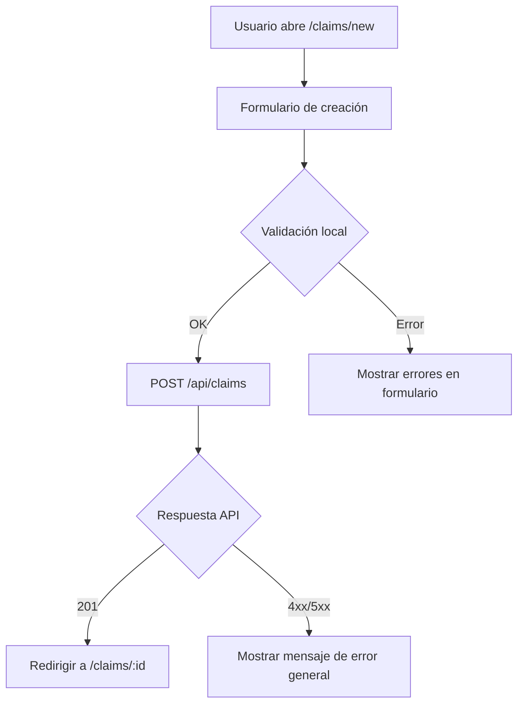
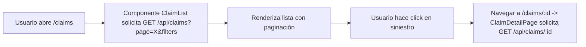

# Sistema de Gestión de Siniestros - Frontend
  -Portal web para la gestión y visualización de siniestros de seguros-
  
Resumen técnico y funcional orientado a analistas funcionales y equipos de desarrollo.

## Descripción

- Propósito: Interfaz frontend para gestión de siniestros automotor. Permite listar, crear, ver detalle y editar siniestros.
- Audiencia: Analistas funcionales, desarrolladores frontend, y equipos QA/DevOps.

## Principales funcionalidades

- Listado de siniestros con filtros y paginación.
- Visualización detallada de un siniestro.
- Creación y edición de siniestros.
- Manejo de errores y rutas de navegación (página 404 incluida).

## Contexto técnico

- Framework: Quasar + Vue 3 + TypeScript.
- Estructura principal:
  - `src/pages`: vistas y páginas (Index, Claims, ClaimDetail, ClaimNew).
  - `src/components`: componentes reutilizables (ej. `ClaimList.vue`).
  - `src/services/claimService.ts`: capa de comunicación con la API (axios).
  - `src/interfaces/models.ts`: definiciones de modelos/DTO usados en la app.
  - `src/utils/sanitizer.ts`: utilidades de sanitización y validación ligera.

## Arquitectura funcional

- Capa UI: páginas y componentes presentan datos y capturan acciones del usuario.
- Capa de servicio: `claimService` encapsula llamadas REST (GET/POST/PUT/DELETE).
- Modelo de datos: `models.ts` define las entidades principales (Claim y subtipos).
- Flujo típico: la vista llama al servicio → servicio usa `axios` en `boot/axios.ts` → recibe/transforma datos → componente renderiza.

## Instalación (desarrollo)

1. Clonar el repositorio.
2. Instalar dependencias:

```bash
npm install
```

3. Ejecutar en modo desarrollo:

```bash
npm run dev
```

## Configuración y variables

- Revisar `boot/axios.ts` para la configuración base de la API (baseURL, interceptores de error/autenticación).
- Si hay variables de entorno, definirlas en el entorno de ejecución o en el archivo `.env` según convenga.

## Convenciones y buenas prácticas

- Componentes: mantener simples; delegar llamadas HTTP a `services`.
- Tipado: usar las interfaces de `src/interfaces/models.ts` en props y respuestas.
- Manejo de errores: centralizar en interceptores de axios para mostrar mensajes consistentes.

## Estructura de carpetas (resumen)

- `src/pages` — Vistas por ruta.
- `src/components` — Componentes reutilizables.
- `src/services` — Lógica de consumo de API.
- `src/interfaces` — Modelos y tipos.
- `src/boot` — Inicializadores (axios, plugins).

## Puntos funcionales relevantes para QA / Product

- Casos clave a probar: creación de siniestro, edición, validación de campos, manejo de respuestas 4xx/5xx, comportamiento de paginación y filtros.
- Rutas críticas: `/claims`, `/claims/new`, `/claims/:id`.

## Diagramas de flujo

Flujo de creación de un siniestro:



## Flujo de listado y navegación a detalle:



## Ejemplos de request / response (contratos API)

- Obtener listado de siniestros

Request:

```http
GET /api/claims?page=1&limit=20&status=open HTTP/1.1
Host: api.example.com
Accept: application/json
Authorization: Bearer <token>
```

Response 200:

```json
{
  "data": [
    {
      "id": "c123",
      "policyNumber": "P-0001",
      "insured": "Juan Perez",
      "status": "open",
      "createdAt": "2026-06-01T12:34:56Z"
    }
  ],
  "meta": {
    "page": 1,
    "limit": 20,
    "total": 124
  }
}
```

- Crear siniestro

Request:

```http
POST /api/claims HTTP/1.1
Host: api.example.com
Content-Type: application/json
Authorization: Bearer <token>

{
	"policyNumber": "P-0002",
	"insured": "María López",
	"incidentDate": "2026-06-20",
	"description": "Choque trasero en avenida",
	"vehicle": {
		"plate": "ABC123",
		"model": "Toyota Corolla 2018"
	}
}
```

Response 201 (ejemplo):

```json
{
  "id": "c124",
  "policyNumber": "P-0002",
  "insured": "María López",
  "status": "open",
  "createdAt": "2026-06-20T09:00:00Z"
}
```

- Obtener detalle de siniestro

Request:

```http
GET /api/claims/c124 HTTP/1.1
Host: api.example.com
Accept: application/json
Authorization: Bearer <token>
```

Response 200 (ejemplo):

```json
{
  "id": "c124",
  "policyNumber": "P-0002",
  "insured": "María López",
  "incidentDate": "2026-06-20",
  "description": "Choque trasero en avenida",
  "vehicle": { "plate": "ABC123", "model": "Toyota Corolla 2018" },
  "status": "open",
  "history": []
}
```

Errores comunes y formatos

- Error de validación (400):

```json
{
  "error": "ValidationError",
  "details": {
    "policyNumber": "Campo requerido",
    "incidentDate": "Formato inválido"
  }
}
```

- Error de servidor (500):

```json
{
  "error": "ServerError",
  "message": "Error interno, reintentar más tarde"
}
```

## Despliegue

- El frontend produce un build estático (dependiendo de la configuración de Quasar). Comando típico:

```bash
npm run build
```

- El resultado se sirve desde un servidor estático (NGINX, CDN o similar) o se integra en un pipeline CI/CD.

## Cómo colaborar

- Crear ramas feature/bugfix con prefijo `feature/` o `fix/`.
- Abrir PRs con descripción funcional y técnica, pasos para reproducir y pruebas realizadas.

Contacto y soporte

- Para dudas funcionales: responsable del producto / equipo de negocio.
- Para dudas técnicas: equipo frontend (revisar historial de commits y `package.json` para autores).


